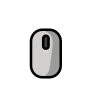

# Mouse Scroll Cue

<p align="center">
  
</p>

<p align="center">
  <a href="https://www.npmjs.com/package/mouse-scroll-cue"></a>
  <a href="https://github.com/chathurabuddi/mouse-scroll-cue/actions/workflows/ci.yml"></a>
  <a href="#license"></a>
</p>

An animated "scroll down" hint for the web, in a single SVG file with no JavaScript and no dependencies.

> [!NOTE]
> This is an implementation of **[Mouse scroll tooltip Microinteraction](https://www.figma.com/community/file/1255139674516193870/mouse-scroll-tooltip-microinteraction)** by **[Airat](https://www.figma.com/@airatdesign)**, shared on Figma Community under [CC BY 4.0](https://creativecommons.org/licenses/by/4.0/).
> The design, and the credit for it, belongs to Airat.
> This project rebuilds the Figma prototype in code so it can be dropped into any website.

**[See the live demo](https://chathurabuddi.github.io/mouse-scroll-cue/)**

## Features

- **One small file.** About 5 KB, or 2.2 KB gzipped, with no scripts, fonts or network requests.
- **Faithful motion.** The prototype's Smart Animate spring is sampled into a CSS `linear()` easing, and a test keeps it within 0.0015 of that spring curve.
- **Graceful fallback.** Browsers without `linear()` get a close `cubic-bezier()` curve instead.
- **Respects reduced motion.** A `prefers-reduced-motion` rule stops the animation when the visitor asks for less motion.
- **Safe to inline.** Every class, id and keyframes name starts with `mouse-scroll-cue-`, so it cannot clash with your page.
- **Credit built in.** The attribution for the original design lives inside the file, so it travels with every copy.

## Install

### CDN

```html

```

### npm

```bash
npm install mouse-scroll-cue
```

The file is at `node_modules/mouse-scroll-cue/mouse-scroll-cue.svg`, and the package exports it as `mouse-scroll-cue/mouse-scroll-cue.svg`.
With [Vite](https://vite.dev/guide/assets), importing it gives you its URL:

```js
import scrollCueUrl from 'mouse-scroll-cue/mouse-scroll-cue.svg';
```

### Download

Grab [`mouse-scroll-cue.svg`](https://github.com/chathurabuddi/mouse-scroll-cue/blob/main/mouse-scroll-cue.svg) and put it next to your other images.
Keep the comment at the top of the file, because it carries the credit the license asks for.

## Usage

### As an image

This is the simplest option and works everywhere.

```html

```

### As a CSS background

```css
.scroll-cue {
  width: 92px;
  aspect-ratio: 92 / 106;
  background: url('mouse-scroll-cue.svg') center / contain no-repeat;
}
```

### Inline

Paste the file's `<svg>` markup straight into your HTML when you want it with no extra request.
Add `aria-hidden="true"` to the `<svg>` element, because the cue is decorative.
Inline it once per page at most, because the markup contains an `id` for its blur filter.
For several cues on one page, use `` instead.

### Sizing

The file is a 92 by 106 frame.
Scale it to any size, but keep that ratio.
The frame is part of the look: the arrows slide out past its top and bottom edges and are clipped there, so do not crop it.

### Colours and backgrounds

The cue is made for dark backgrounds, because its arrows are white, as in the original design.
The colours are fixed in the file.
If you need different ones, edit the `fill` and `stroke` values in your copy, and add a line to its `Changes:` note, as the license asks.

## Accessibility

- The cue is decorative, so give it `alt=""` as an image, or `aria-hidden="true"` inline.
- It includes a `prefers-reduced-motion: reduce` rule that stops the animation and leaves the cue at rest.
- It does not flash.

## Browser support

The cue uses only SVG and CSS animations, with no scripts.
The exact spring easing uses CSS `linear()`, supported since Chrome 113, Edge 113, Firefox 112 and Safari 17.2 ([MDN](https://developer.mozilla.org/en-US/docs/Web/CSS/easing-function/linear)).
Older browsers ignore that declaration and fall back to a `cubic-bezier()` curve that is close, but not identical.

## How the animation works

The Figma prototype loops like this: wait 1ms, run Smart Animate on a spring for 2315ms, wait 1ms, then snap back.
That is one 2317ms CSS animation, repeated forever.
The spring is modelled as critically damped, `1 - (1 + wt)e^(-wt)` with `w = sqrt(23.33)`, about 4.83, and sampled into the stops of a `linear()` easing.
The wheel dot rises 17px, and the two arrows slide 30px up and 28px down, all on that one easing.
`test/mouse-scroll-cue.test.mjs` checks the stops against the spring across the whole loop.

## Credits

- **Design:** [Airat](https://www.figma.com/@airatdesign), [Mouse scroll tooltip Microinteraction](https://www.figma.com/community/file/1255139674516193870/mouse-scroll-tooltip-microinteraction), CC BY 4.0.
- **SVG implementation:** [Chathura Buddhika](https://github.com/chathurabuddi).

If you use the cue, please credit both.
[NOTICE.md](https://github.com/chathurabuddi/mouse-scroll-cue/blob/main/NOTICE.md#giving-credit-when-you-use-the-svg) has a ready-made credit line.

## License

| Part                                                                                              | License                                                                                    |
| ------------------------------------------------------------------------------------------------- | ------------------------------------------------------------------------------------------ |
| `mouse-scroll-cue.svg` and `media/preview.svg`                                                    | [CC BY 4.0](https://github.com/chathurabuddi/mouse-scroll-cue/blob/main/LICENSE-CC-BY-4.0) |
| [Code of Conduct](https://github.com/chathurabuddi/mouse-scroll-cue/blob/main/CODE_OF_CONDUCT.md) | CC BY-SA 4.0, from Contributor Covenant                                                    |
| Everything else: demo page, scripts, tests, workflows                                             | [MIT](https://github.com/chathurabuddi/mouse-scroll-cue/blob/main/LICENSE-MIT)             |

The SVG stays under CC BY 4.0 because it adapts Airat's CC BY 4.0 design.
See [NOTICE.md](https://github.com/chathurabuddi/mouse-scroll-cue/blob/main/NOTICE.md) for the full attribution and the list of changes.

## Contributing

Bug reports and pull requests are welcome.
Please read [CONTRIBUTING.md](https://github.com/chathurabuddi/mouse-scroll-cue/blob/main/CONTRIBUTING.md) and the [Code of Conduct](https://github.com/chathurabuddi/mouse-scroll-cue/blob/main/CODE_OF_CONDUCT.md) first.
For security issues, see [SECURITY.md](https://github.com/chathurabuddi/mouse-scroll-cue/blob/main/SECURITY.md).
Release notes live on the [releases page](https://github.com/chathurabuddi/mouse-scroll-cue/releases).
